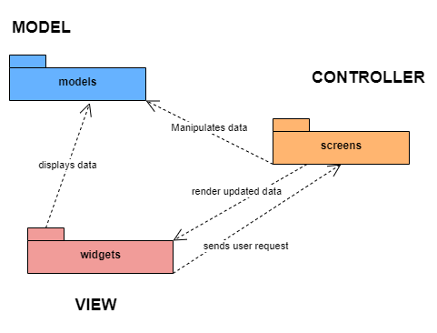
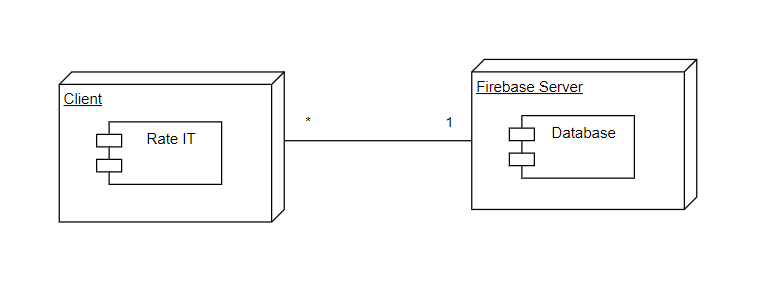

## Architecture and Design

### Logical architecture
We decided to use the MVC (Model-View-Controller) architecture to organize and structure our project in a high-level logical way:

- *Model*: The models package contains the data structures and business logic of the application. It represents the state of the application and handles data manipulation and validation. The model interacts with the database or other external data sources to retrieve and persist data.

- *View*: The widgets package contains the user interface components of the application. It represents the views of the application and displays the data to the user. Widgets interact with the user and allow the user to interact with the application. They provide a visual representation of the data and facilitate user input.

- *Controller*: The screens package contains the controllers of the application. It mediates between the models and the widgets, handling user input and updating the view accordingly. The screen receives input from the user, updates the model accordingly, and then updates the view to reflect the changes. It also handles any business logic related to the user input.

In summary, the models package contains the data and business logic, the widgets package contains the user interface components, and the screens package mediates between the two, handling user input and updating the view and model as needed.

### Physical architecture
We have two principle external entities in our project: Firebase and ITJobs. From ITJobs we fetch the data present in its API through an HTTP protocol, and then the information is stored locally in the devices. On the other hand, we use Firebase Firestore to store our users reviews and other profile informations, such as their biography. Then with Firebase Authentication we let the users register or log in in the application. Finally, with Firebase Cloud Storage we are able to store the profile pictures of our users!

Regarding technologies used, we programmed in Flutter along with Firebase to store data on reviews, companies, formations and events. We chose Firebase for our database server because it easily integrates with Flutter and is simple to set up.

### Vertical prototype
We decided to start our project development by created our app UI on FIGMA (all these mockups can be found in the User Stories). Then, we decided to get a better understanding of how to utilize Flutter, by implementing in Rate IT a subsection with the creators and developers that are going to make this project happen (Credits).

Down bellow there's a little gif of how this first version turned out:

