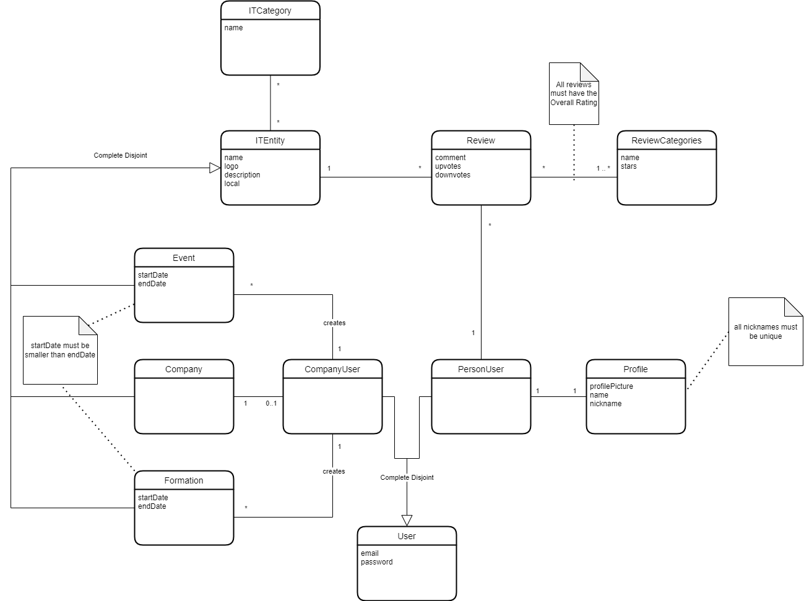

## Requirements

### Domain model

To better understand the context of the software system, it is very useful to have a simple UML class diagram with all the key concepts (names, attributes) and relationships involved of the problem domain addressed by your module. 
Also provide a short textual description of each class. 

- `Event`: Represents an event with a start and end date.
- `CompanyUser`: Represents a user associated with a company. A Company user can create formations and events.
- `Company`: Represents an IT Formation.
- `Formation`: Represents the process of forming a company.
- `PersonUser`: Represents an individual user. A person user can review IT Entitys.
- `User`: Represents a user with email and password login information.
- `Profile`: Represents a user's profile information, including their profile picture, name, and nickname. All nicknames are unic
- `ReviewCategories`: Represents categories of reviews that users can leave, including a name and star rating system. All reviews must have an overall category
- `Review`: Represents a user's review of an IT Entity, including a comment. Other users can upvote or downvote the review.
- `ITEntity`: Represents an IT entity, such as a software or hardware company, including its name, logo, description, and location.
- `ITCategory`: Represents categories of IT entities, including a name.

